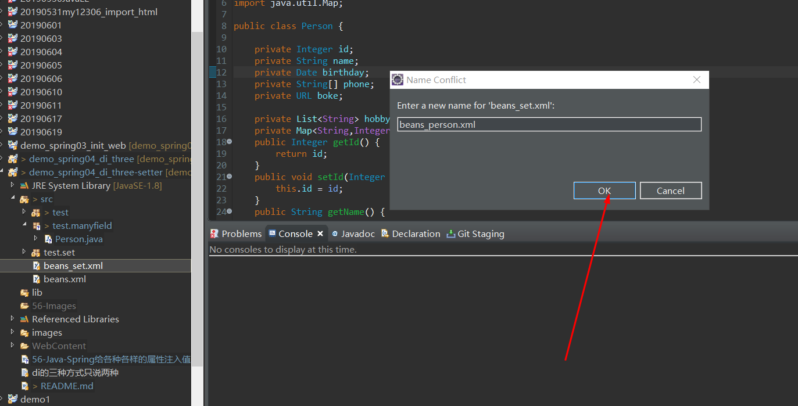
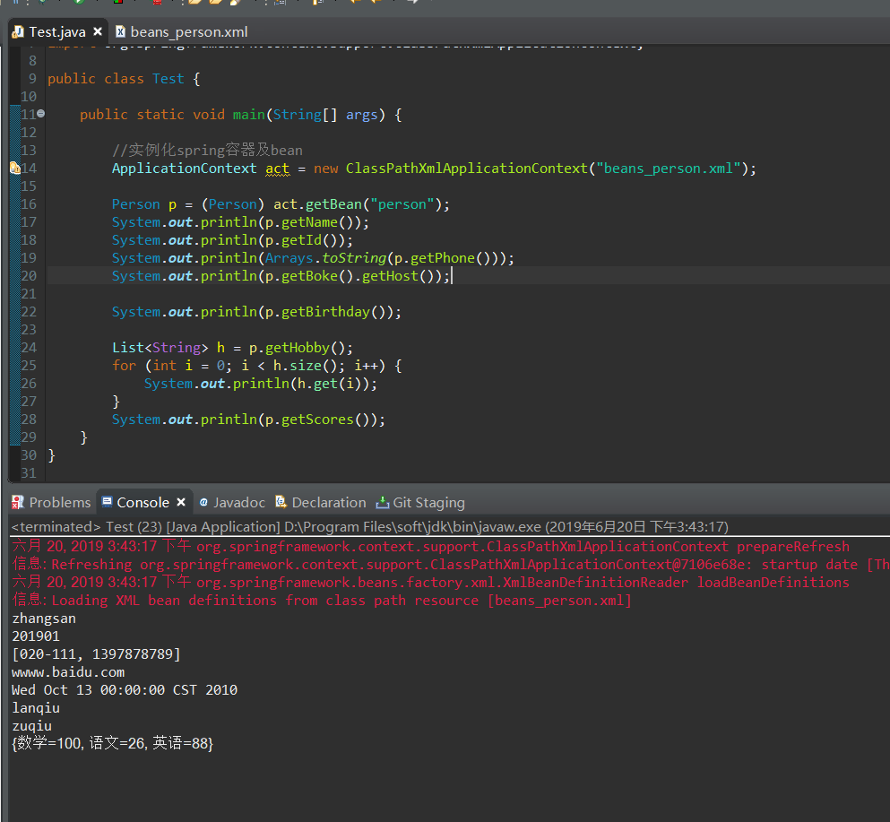

# Java-Spring给各种各样的属性注入值

*沿用之前的项目*

1. 新建一个包 test.manyfield/Person

**Person** .java

```
package test.manyfield;

import java.net.URL;
import java.util.Date;
import java.util.List;
import java.util.Map;

public class Person {

	private Integer id;
	private String name;
	private Date birthday;
	private String[] phone;
	private URL boke;
	
	private List<String> hobby;
	private Map<String,Integer> scores;
	public Integer getId() {
		return id;
	}
	public void setId(Integer id) {
		this.id = id;
	}
	public String getName() {
		return name;
	}
	public void setName(String name) {
		this.name = name;
	}
	public Date getBirthday() {
		return birthday;
	}
	public void setBirthday(Date birthday) {
		this.birthday = birthday;
	}
	public String[] getPhone() {
		return phone;
	}
	public void setPhone(String[] phone) {
		this.phone = phone;
	}
	public URL getBoke() {
		return boke;
	}
	public void setBoke(URL boke) {
		this.boke = boke;
	}
	public List<String> getHobby() {
		return hobby;
	}
	public void setHobby(List<String> hobby) {
		this.hobby = hobby;
	}
	public Map<String, Integer> getScores() {
		return scores;
	}
	public void setScores(Map<String, Integer> scores) {
		this.scores = scores;
	}
}
```
2. 配置xml文件

+ 复制或新建一个beans.xml



+ 配置xml

**beans_person.xml**

```
<?xml version="1.0" encoding="UTF-8"?>

<beans xmlns="http://www.springframework.org/schema/beans"
       xmlns:xsi="http://www.w3.org/2001/XMLSchema-instance" xmlns:tx="http://www.springframework.org/schema/tx"
       xmlns:context="http://www.springframework.org/schema/context"
       xsi:schemaLocation="http://www.springframework.org/schema/beans 
       http://www.springframework.org/schema/beans/spring-beans.xsd 
       http://www.springframework.org/schema/tx 
       http://www.springframework.org/schema/tx/spring-tx.xsd 
       http://www.springframework.org/schema/context 
       http://www.springframework.org/schema/context/spring-context.xsd">
<!--        	
		private Integer id;
		private String name;
		private Date birthday;
		private String[] phone;
		private URL boke;
		private List<String> hobby;
		private Map<String,Integer> scores; 
		-->
		
<!--        如何通过配置的方式给person这个bean注入值呢？ -->
	<bean id="person" class="test.manyfield.Person">
		<property name="id" value="201901"></property>
		<property name="name" value="zhangsan"></property>
		<property name="birthday" value="2010/10/13"></property>
		<property name="phone">
			<!-- 数组的写法 -->
			<list>
				<value>020-111</value>
				<value>1397878789</value>
			</list>
		</property>
		<property name="boke" value="http://wwww.baidu.com"></property>
		<property name="hobby">
		<!-- list集合的写法 -->
			<list>
				<value>lanqiu</value>
				<value>zuqiu</value>
			</list>
		</property>
		<property name="scores">
			<!-- map集合的写法 -->
			<map>
				<entry key="数学">
					<value>100</value>
				</entry>
				<entry key="语文">
					<value>26</value>
				</entry>
				<entry key="英语">
					<value>88</value>
				</entry>
			</map>
		</property>
	</bean>
</beans>
```
3. 测试

**Test.java**
```
package test.manyfield;

import java.util.Arrays;
import java.util.List;

import org.springframework.context.ApplicationContext;
import org.springframework.context.support.ClassPathXmlApplicationContext;

public class Test {

	public static void main(String[] args) {

		//实例化spring容器及bean
		ApplicationContext act = new ClassPathXmlApplicationContext("beans_person.xml");
		
		Person p = (Person) act.getBean("person");
		System.out.println(p.getName());
		System.out.println(p.getId());
		System.out.println(Arrays.toString(p.getPhone()));
		System.out.println(p.getBoke().getHost());
		
		System.out.println(p.getBirthday());
		
		List<String> h = p.getHobby();
		for (int i = 0; i < h.size(); i++) {
			System.out.println(h.get(i));
		}
		System.out.println(p.getScores());
	}
}
```
**测试得到结果如下：**


**以上就是我对Java-Spring给各种各样的属性注入值 的知道点的总结**

==================================================================
#### 分割线
==================================================================

**博主为咯学编程：父母不同意学编程，现已断绝关系;恋人不同意学编程，现已分手;亲戚不同意学编程，现已断绝来往;老板不同意学编程,现已失业三十年。。。。。。如果此博文有帮到你欢迎打赏，金额不限。。。**

