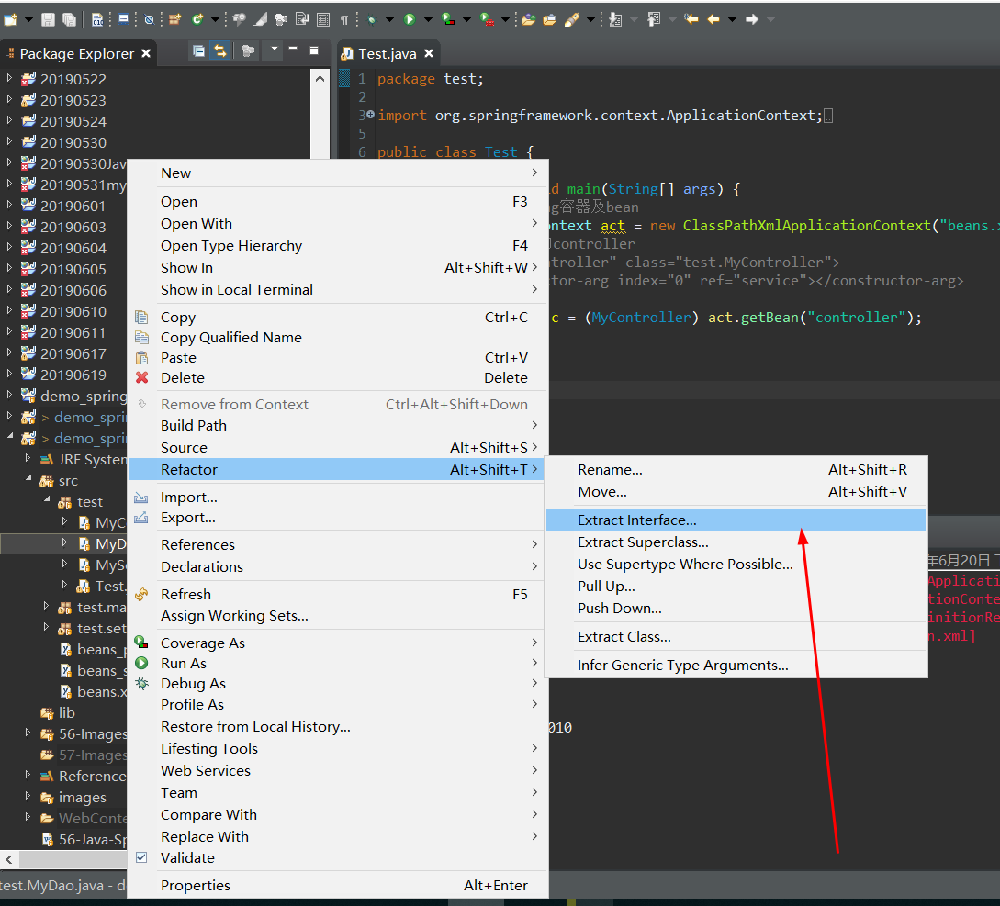
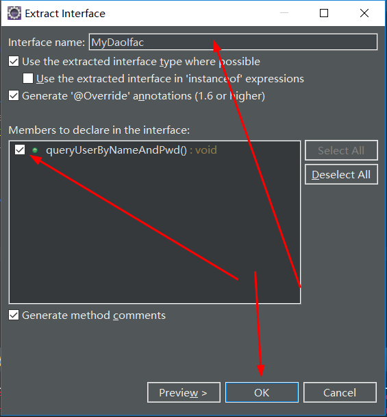
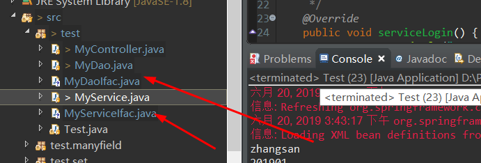
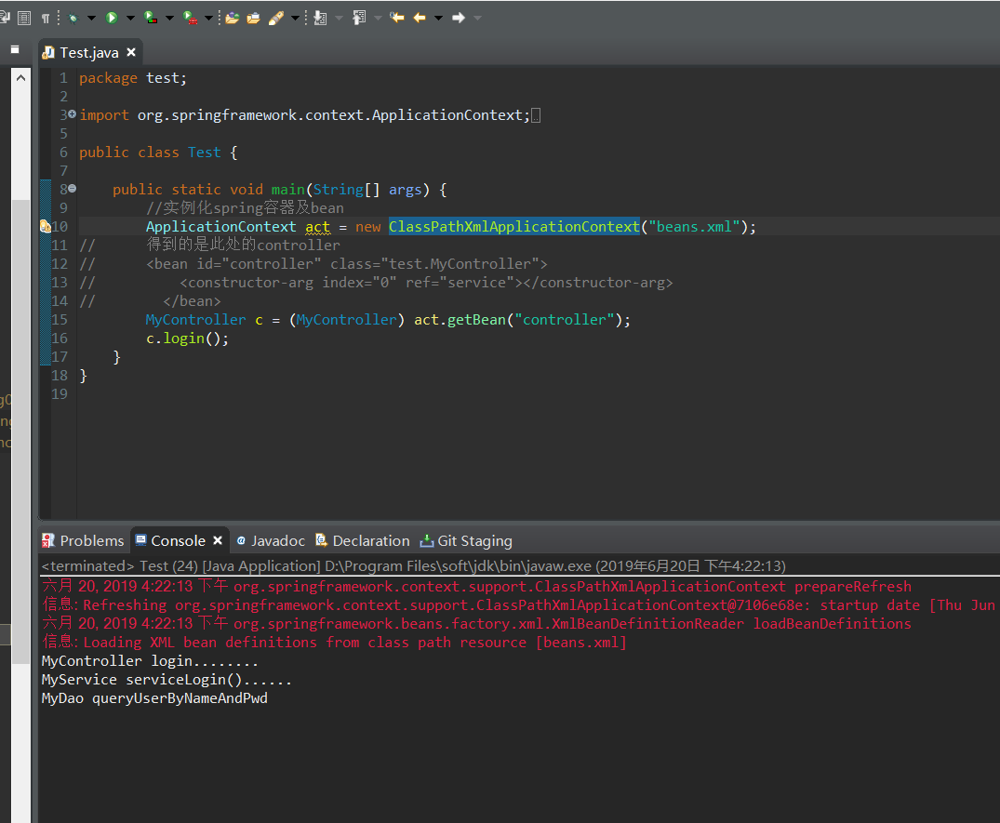

# Java重构代码之面向接口编程

*沿用上一个项目*

1. 之前项目test包里类的代码如下：

**Mycontroller**
```
package test;

public class MyController {

	private MyService service;
	
	public MyController(MyService myService)
	{
		this.service = myService;
	}
	public void login() 
	{
		System.out.println("MyController login........");
		service.serviceLogin();
	}
}
```
**MyDao**
```
package test;

public class MyDao {

	public void queryUserByNameAndPwd() 
	{
		System.out.println("MyDao queryUserByNameAndPwd");
	}
}
```
**MyService**
```
package test;

public class MyService {

	private MyDao dao;//MyService依赖MyDao
	/**
	 * 为咯给属性赋值 就在属性所在的
	 * 类里面设置一个构造方法
	 * 并且该构造方法接收一个该属性类开的参数
	 * <p>Title: </p>  
	 * <p>Description: </p>  
	 * @param myDao
	 */
	public MyService(MyDao myDao)
	{
		this.dao = myDao;
	}
	public void serviceLogin() {
		System.out.println("MyService serviceLogin()......");
		dao.queryUserByNameAndPwd();
	}
}
```
**Test**
```
package test;

import org.springframework.context.ApplicationContext;
import org.springframework.context.support.ClassPathXmlApplicationContext;

public class Test {

	public static void main(String[] args) {
		//实例化spring容器及bean
		ApplicationContext act = new ClassPathXmlApplicationContext("beans.xml");
//		得到的是此处的controller
//	    <bean id="controller" class="test.MyController">
//			<constructor-arg index="0" ref="service"></constructor-arg>
//        </bean>
		MyController c = (MyController) act.getBean("controller");
		c.login();
	}
}
```
2. 抽取接口





**MyService也是同样的操作实现接口MyServiceIfac**



3. 抽取接口后各类的代码如下：

**MyController**

```
package test;

public class MyController {

	private MyServiceIfac service;
	
	public MyController(MyServiceIfac myService)
	{
		this.service = myService;
	}
	public void login() 
	{
		System.out.println("MyController login........");
		service.serviceLogin();
	}
}

```

**MyDao**

```
package test;

public class MyDao implements MyDaoIfac {

	/* (non-Javadoc)  
	 * <p>Title: queryUserByNameAndPwd</p>  
	 * <p>Description: </p>    
	 * @see test.MyDaoIfac#queryUserByNameAndPwd()  
	 */
	@Override
	public void queryUserByNameAndPwd() 
	{
		System.out.println("MyDao queryUserByNameAndPwd");
	}
}
```
**MyDaoIfac**
```
package test;

public interface MyDaoIfac {

	void queryUserByNameAndPwd();

}
```

**MyService**

```
package test;

public class MyService implements MyServiceIfac {

	private MyDaoIfac dao;//MyService依赖MyDao
	/**
	 * 为咯给属性赋值 就在属性所在的
	 * 类里面设置一个构造方法
	 * 并且该构造方法接收一个该属性类开的参数
	 * <p>Title: </p>  
	 * <p>Description: </p>  
	 * @param myDao
	 */
	public MyService(MyDaoIfac myDao)
	{
		this.dao = myDao;
	}
	/* (non-Javadoc)  
	 * <p>Title: serviceLogin</p>  
	 * <p>Description: </p>    
	 * @see test.MyServiceIfac#serviceLogin()  
	 */
	@Override
	public void serviceLogin() {
		System.out.println("MyService serviceLogin()......");
		dao.queryUserByNameAndPwd();
	}
}
```

**MyServiceIfac**

```
package test;

public interface MyServiceIfac {

	void serviceLogin();

}
```
4. 测试

**如图所示，测试通过**


**作用：** 调用者跟被调用者不能见面,实现解耦合，无须更改配置文件

**以上就是我对于Java重构代码之面向接口编程 的知识点的总结**

==================================================================
#### 分割线
==================================================================

**博主为咯学编程：父母不同意学编程，现已断绝关系;恋人不同意学编程，现已分手;亲戚不同意学编程，现已断绝来往;老板不同意学编程,现已失业三十年。。。。。。如果此博文有帮到你欢迎打赏，金额不限。。。**

