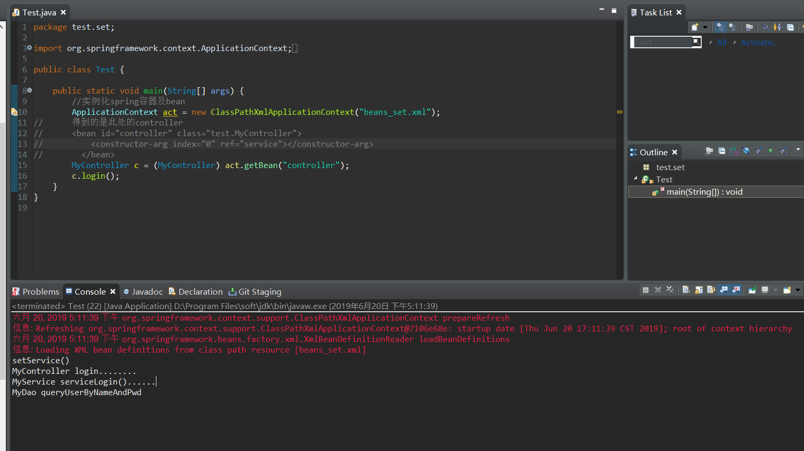

# Java-Spring根据类型自动装配属性

*沿用上一个项目*

1. 修改beans_set.xml;修改后结果如下

```
<?xml version="1.0" encoding="UTF-8"?>

<beans xmlns="http://www.springframework.org/schema/beans"
       xmlns:xsi="http://www.w3.org/2001/XMLSchema-instance" xmlns:tx="http://www.springframework.org/schema/tx"
       xmlns:context="http://www.springframework.org/schema/context"
       xsi:schemaLocation="http://www.springframework.org/schema/beans 
       http://www.springframework.org/schema/beans/spring-beans.xsd 
       http://www.springframework.org/schema/tx 
       http://www.springframework.org/schema/tx/spring-tx.xsd 
       http://www.springframework.org/schema/context 
       http://www.springframework.org/schema/context/spring-context.xsd">
  <!--      先配置最底层的Dao -->
       <bean id="dao" class="test.set.MyDao"></bean>
       
       <!--
       
       autowire="byName" 表示根据名字自动装配
            还有一个值是byType 表示根据类型自动装配属性
         -->
       <bean id="service" class="test.set.MyService" autowire="byType">
       <!-- 
       	private MyDao dao;//MyService依赖MyDao
       	name=""里的值属性与这里的属性名相同
       	ref=""里的值属性与所依赖的类的bean的id值相同
        -->
		<!-- 	<property name="dao" ref="dao"></property> -->
       </bean>
       <bean id="controller" class="test.set.MyController" autowire="byType">
       	<!-- 	<property name="service" ref="service"></property> -->
       </bean>
</beans>
```

2. 测试;如图所示测试成功



**原理：** 

```
1. autowire="byType" 会根据前面的类class="test.set.MyService"里找到属性dao 的类型 MyDao
2.从容器里找到类型为MyDao的beans  <bean id="dao" class="test.set.MyDao"></bean>
3. 拿到这个bean
4. 再给service里给属性dao赋值
```

**以上就是我对于 Java-Spring根据类型自动装配属性 知识点整理的全部内容**

==================================================================
#### 分割线
==================================================================

**博主为咯学编程：父母不同意学编程，现已断绝关系;恋人不同意学编程，现已分手;亲戚不同意学编程，现已断绝来往;老板不同意学编程,现已失业三十年。。。。。。如果此博文有帮到你欢迎打赏，金额不限。。。**

