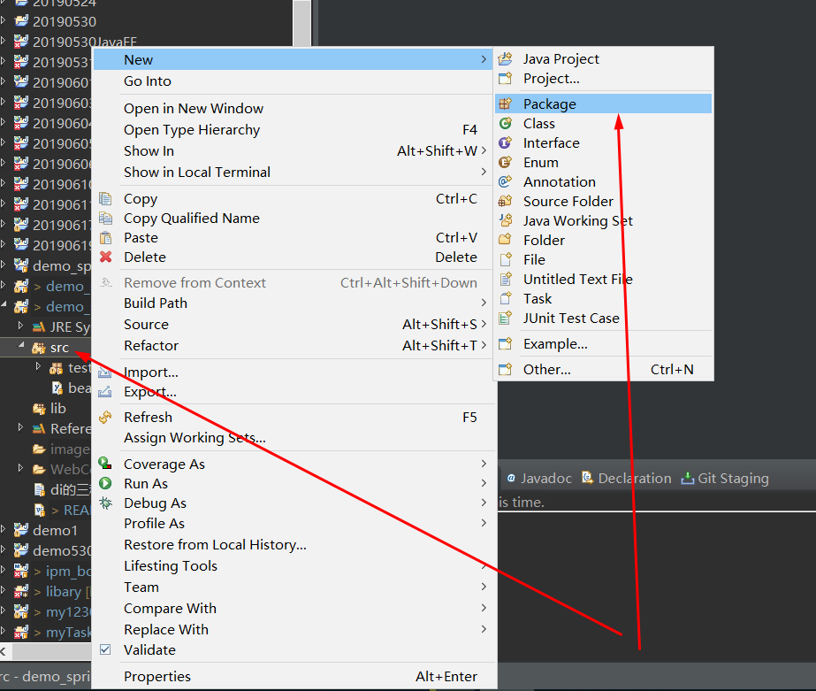
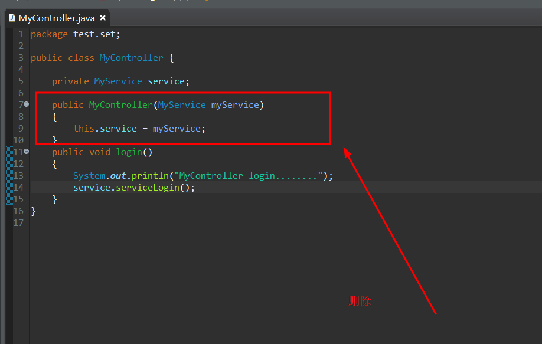
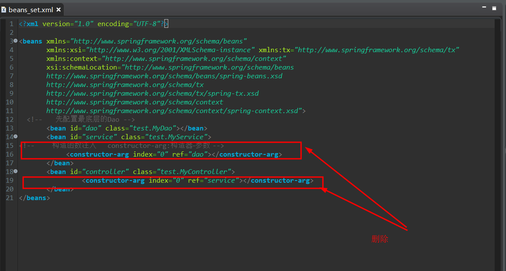

# Java-Spring依赖属性的构造函数注入

1. 新建一个Java Project


2. Java工程导jar包

+ 创建一个lib文件夹


**如图所示新建完成**


+ 导入jar包


+ 新建或导入配置文件

**beans.xml**
```
<?xml version="1.0" encoding="UTF-8"?>

<beans xmlns="http://www.springframework.org/schema/beans"
       xmlns:xsi="http://www.w3.org/2001/XMLSchema-instance" xmlns:tx="http://www.springframework.org/schema/tx"
       xmlns:context="http://www.springframework.org/schema/context"
       xsi:schemaLocation="http://www.springframework.org/schema/beans 
       http://www.springframework.org/schema/beans/spring-beans.xsd 
       http://www.springframework.org/schema/tx 
       http://www.springframework.org/schema/tx/spring-tx.xsd 
       http://www.springframework.org/schema/context 
       http://www.springframework.org/schema/context/spring-context.xsd">
</beans>
```
3. 新建test/MyController  test/MyService test/MyDao


**MyController**
```
package test;

public class MyController {

	private MyService service;
	
	public MyController(MyService myService)
	{
		this.service = myService;
	}
	public void login() 
	{
		System.out.println("MyController login........");
		service.serviceLogin();
	}
}
```
**MyService**
```
package test;

public class MyService {

	private MyDao dao;//MyService依赖MyDao
	/**
	 * 为咯给属性赋值 就在属性所在的
	 * 类里面设置一个构造方法
	 * 并且该构造方法接收一个该属性类开的参数
	 * <p>Title: </p>  
	 * <p>Description: </p>  
	 * @param myDao
	 */
	public MyService(MyDao myDao)
	{
		this.dao = myDao;
	}
	public void serviceLogin() {
		System.out.println("MyService serviceLogin()......");
		dao.queryUserByNameAndPwd();
	}
}
```
**MyDao**
```
package test;

public class MyDao {

	public void queryUserByNameAndPwd() 
	{
		System.out.println("MyDao queryUserByNameAndPwd");
	}
}
```
4. 构造函数配置（亮点加重点）

**beans.xml**

```
<?xml version="1.0" encoding="UTF-8"?>

<beans xmlns="http://www.springframework.org/schema/beans"
       xmlns:xsi="http://www.w3.org/2001/XMLSchema-instance" xmlns:tx="http://www.springframework.org/schema/tx"
       xmlns:context="http://www.springframework.org/schema/context"
       xsi:schemaLocation="http://www.springframework.org/schema/beans 
       http://www.springframework.org/schema/beans/spring-beans.xsd 
       http://www.springframework.org/schema/tx 
       http://www.springframework.org/schema/tx/spring-tx.xsd 
       http://www.springframework.org/schema/context 
       http://www.springframework.org/schema/context/spring-context.xsd">
  <!--      先配置最底层的Dao -->
       <bean id="dao" class="test.MyDao"></bean>
       <bean id="service" class="test.MyService">
<!--        构造函数注入     constructor-arg:构造器-参数 -->
			<constructor-arg index="0" ref="dao"></constructor-arg>
       </bean>
       <bean id="controller" class="test.MyController">
       			<constructor-arg index="0" ref="service"></constructor-arg>
       </bean>
</beans>
```
5. 新建测试类测试


**Test.java**
```
package test;

import org.springframework.context.ApplicationContext;
import org.springframework.context.support.ClassPathXmlApplicationContext;

public class Test {

	public static void main(String[] args) {
		//实例化spring容器及bean
		ApplicationContext act = new ClassPathXmlApplicationContext("beans.xml");
//		得到的是此处的controller
//	    <bean id="controller" class="test.MyController">
//			<constructor-arg index="0" ref="service"></constructor-arg>
//        </bean>
		MyController c = (MyController) act.getBean("controller");
		c.login();
	}
}
```


**如图所示测试成功**


#### 总结

属性注入的两种方式：

1.构造函数注入：

//需要在类中定义构造方法，并且接收参数，便于给属性赋值
```
public MyController(MyService myService)
	{
		this.service=myService;
	}
	
public MyService(MyDao myDao)
	{
		this.dao=myDao;
	}
```
//接着在配置文件中对bean进行配置，特别注意给构造方法中的参数赋值
```
	<bean id="dao" class="test.MyDao">
	
	</bean>
	<bean id="service" class="test.MyService">
	<constructor-arg index="0" ref="dao"></constructor-arg>
	</bean>
	
	
	<bean id="controller" class="test.MyController">
	<constructor-arg index="0" ref="service"></constructor-arg>
	</bean>
```

2.属性的setter方法注入
```
//需要提供属性的setter方法

//需要在配置bean的时候使用标签<property>给属性赋值
```
**以上就是我对于 Java-Spring依赖属性的构造函数注入 知识点整理的全部内容** 另附[源码](https://github.com/javaobjects/demo_spring04_di_three)

==================================================================
#### 分割线
==================================================================

**博主为咯学编程：父母不同意学编程，现已断绝关系;恋人不同意学编程，现已分手;亲戚不同意学编程，现已断绝来往;老板不同意学编程,现已失业三十年。。。。。。如果此博文有帮到你欢迎打赏，金额不限。。。**

