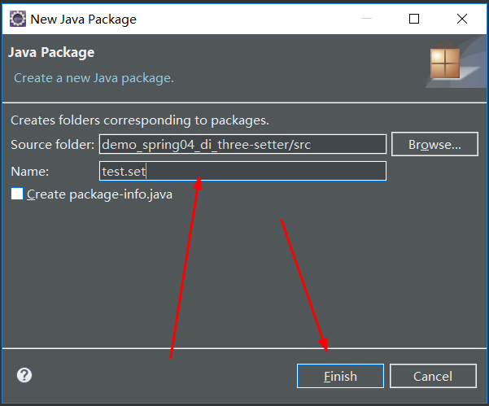
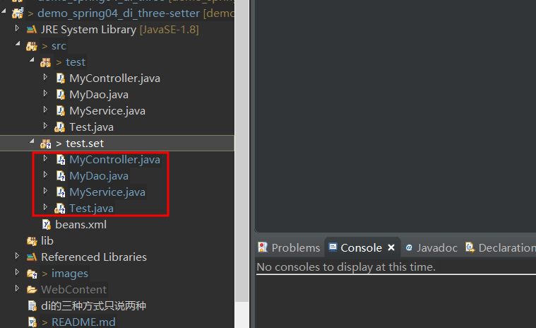
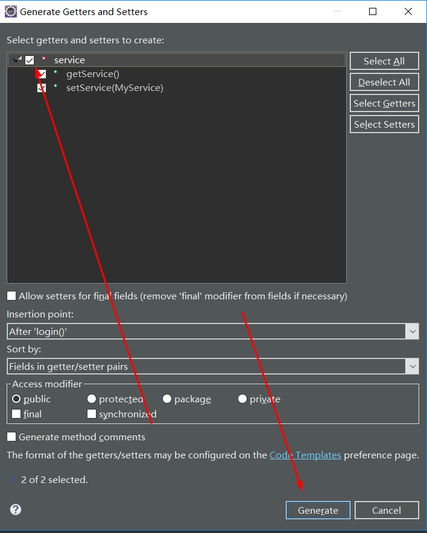
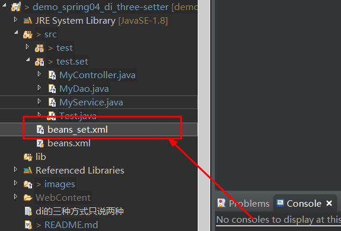
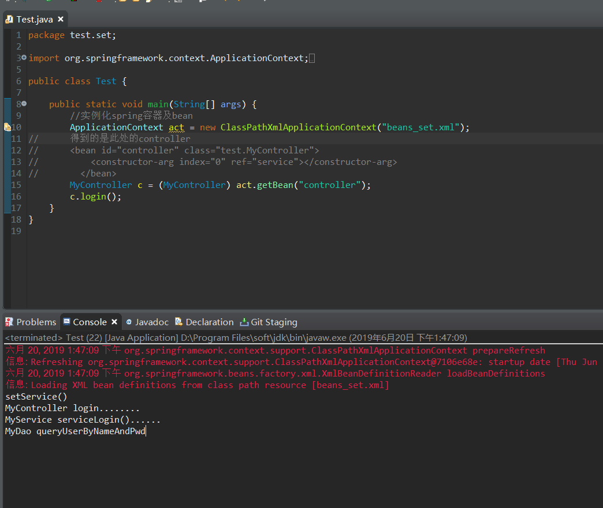

# Java-Spring依赖属性的setter方法注入值

1. 沿用上一个项目 
+ 新建包




+ 拷贝之之前的类到新建的包里test.set


2. 删除构造方法并且为属性生成get&set方法

+ 删除构造方法


+ 生成get&set方法




**MyController.java**
```
package test.set;

public class MyController {

	private MyService service;
	
	public void login() 
	{
		System.out.println("MyController login........");
		service.serviceLogin();
	}

	public MyService getService() {
		return service;
	}

	public void setService(MyService service) {
		this.service = service;
	}
}
```

**MyService** .java也是相同的操作

3. 修改配置文件

+ 先拷贝一个配置文件并且重命名以防冲突



+ 删除构造方法配置


+ 重写配置文件 beans_set.xml

```
<?xml version="1.0" encoding="UTF-8"?>

<beans xmlns="http://www.springframework.org/schema/beans"
       xmlns:xsi="http://www.w3.org/2001/XMLSchema-instance" xmlns:tx="http://www.springframework.org/schema/tx"
       xmlns:context="http://www.springframework.org/schema/context"
       xsi:schemaLocation="http://www.springframework.org/schema/beans 
       http://www.springframework.org/schema/beans/spring-beans.xsd 
       http://www.springframework.org/schema/tx 
       http://www.springframework.org/schema/tx/spring-tx.xsd 
       http://www.springframework.org/schema/context 
       http://www.springframework.org/schema/context/spring-context.xsd">
  <!--      先配置最底层的Dao -->
       <bean id="dao" class="test.set.MyDao"></bean>
       <bean id="service" class="test.set.MyService">
       <!-- 
       	private MyDao dao;//MyService依赖MyDao
       	name=""里的值属性与这里的属性名相同
       	ref=""里的值属性与所依赖的类的bean的id值相同
        -->
			<property name="dao" ref="dao"></property>
       </bean>
       <bean id="controller" class="test.set.MyController">
       		<property name="service" ref="service"></property>
       </bean>
</beans>
```
4. 测试

+ 为咯验证是set方法注入在set方法内写入一段测试代码

```
public void setDao(MyDao dao) {
	System.out.println("setDao()....");
	this.dao = dao;
}
	public void setService(MyService service) {
	System.out.println("setService()");
	this.service = service;
}
```
+ 更改没试类代码

```
package test.set;

import org.springframework.context.ApplicationContext;
import org.springframework.context.support.ClassPathXmlApplicationContext;

public class Test {

	public static void main(String[] args) {
		//实例化spring容器及bean
		ApplicationContext act = new ClassPathXmlApplicationContext("beans_set.xml");
//		得到的是此处的controller
//	    <bean id="controller" class="test.MyController">
//			<constructor-arg index="0" ref="service"></constructor-arg>
//        </bean>
		MyController c = (MyController) act.getBean("controller");
		c.login();
	}
}
```
**测试结果如下**


**备注：** 运行过程中有报过某个类红色告警不给过，解决方法为将这个类更改名称而后再次改回来则解决咯这个bug，究其原因是因为Eclipse软件件的bug

**以上就是我对于 Java-Spring依赖属性的setter方法注入值 知识点整理的全部内容** 另附[源码](https://github.com/javaobjects/demo_spring04_di_three-setter.git)

==================================================================
#### 分割线
==================================================================

**博主为咯学编程：父母不同意学编程，现已断绝关系;恋人不同意学编程，现已分手;亲戚不同意学编程，现已断绝来往;老板不同意学编程,现已失业三十年。。。。。。如果此博文有帮到你欢迎打赏，金额不限。。。**

